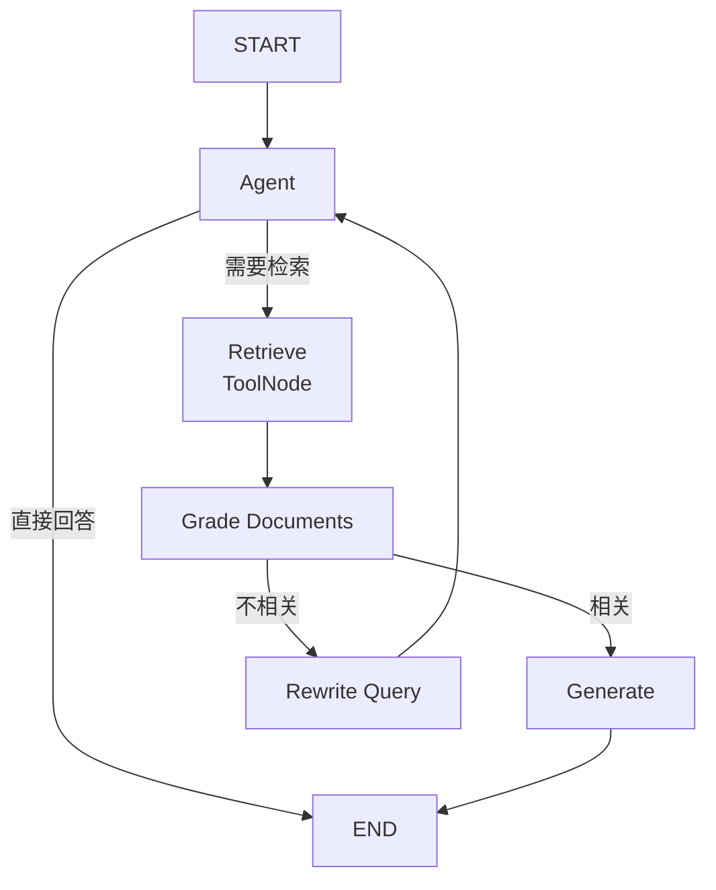
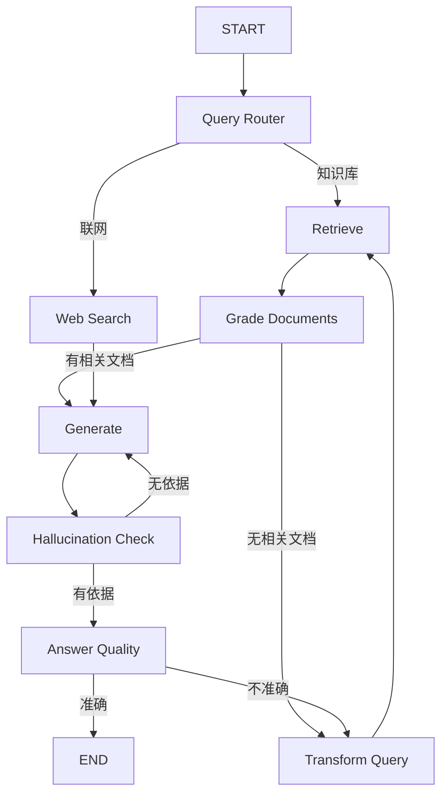
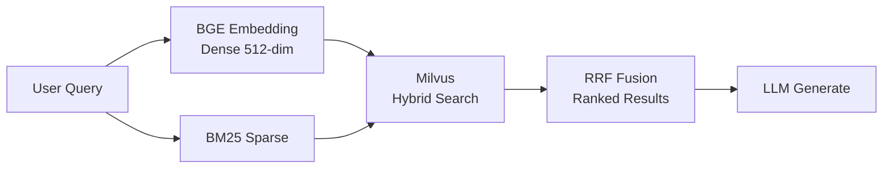

<h1 align="center">Enterprise RAG Knowledge Base</h1>

<p align="center">
  <strong>面向半导体与芯片制造领域的智能知识库问答系统</strong><br>
  双模式 RAG 工作流 · 幻觉检测 · 混合检索 · 前后端分离
</p>

<p align="center">
  
  
  
  
  
</p>

---

## 项目解决什么问题

半导体企业的工艺文档、设备手册、故障排查记录分散在数百个 Markdown/PDF 文件中，工程师查找信息费时费力。直接用 LLM 回答则面临**幻觉严重、无法引用来源**的问题。

本项目通过 **RAG（检索增强生成）** 架构，让 LLM 基于企业内部文档回答问题，并引入幻觉检测与质量评分机制，将领域问答从"演示级对话"打磨为**可长期依赖的企业检索问答工具**。

---

## 系统架构

### 双模式 RAG 工作流

#### 基础模式 — Agent-ToolNode 自主决策



Agent 自主决定是否调用检索工具，检索后对文档相关性评分，不相关则重写查询重新检索，形成闭环。

#### 高级模式 — Corrective RAG（CRAG）



高级模式增加查询路由、Web 搜索兜底、幻觉二元检测、回答质量评估四道关卡，显著降低无依据回答的比例。

### 混合检索架构



Milvus 同时执行 Dense 向量检索与 Sparse BM25 检索，通过 RRF（Reciprocal Rank Fusion）融合排序，兼顾语义理解与关键词精确匹配。

---

## 核心特性

| 特性 | 说明 |
|------|------|
| **双模式 RAG Workflow** | 基础 Agent-ToolNode 自主决策 vs 高级 CRAG（查询路由 + Web 搜索兜底 + 幻觉检测 + 质量评分） |
| **Milvus 混合检索** | Dense BGE 512维 + Sparse BM25，RRF 排序融合 |
| **语义分块** | SemanticChunker 按语义边界切分，替代固定长度切分，减少跨主题碎片噪声 |
| **多进程并发写入** | Producer-Consumer 管道支持海量文档并发入库 |
| **抽象 LLM 接入层** | 统一接口封装，支持 DeepSeek 等模型零停机热切换 |
| **前后端分离** | FastAPI + JWT 鉴权 / React 18 + TypeScript + Ant Design + Zustand |
| **SSE 流式输出** | 实时推送节点状态 + token 级别生成 |
| **权限路由守卫** | 多角色登录、管理员文档管理、前端路由守卫 |

---

## 技术栈

| 层级 | 技术 |
|------|------|
| LLM | DeepSeek V4 Pro（OpenAI 兼容接口，可热切换其他模型） |
| Embedding | BGE-small-zh-v1.5（本地推理，512 维向量） |
| 向量数据库 | Milvus — Dense + Sparse 混合检索，RRF 排序 |
| RAG 框架 | LangGraph + LangChain |
| 后端 | FastAPI + Python 3.12，JWT + bcrypt 认证，SQLite 持久化 |
| 前端 | React 18 + TypeScript + Ant Design + Zustand |
| Web 搜索 | Tavily API（高级模式联网兜底） |

---

## 双模式对比

| 维度 | 基础模式 (Graph v1) | 高级模式 (Graph v2 / CRAG) |
|------|---------------------|---------------------------|
| 决策方式 | Agent-ToolNode 自主决定是否检索 | 查询路由器分类 → 知识库/联网 |
| 文档评分 | 检索后二元相关性评分 | 检索后评分 + 无文档时查询改写/联网兜底 |
| 幻觉处理 | 无 | 二元幻觉检测 + 回答质量评估 |
| 查询优化 | 重写查询 | 改写查询 + 联网搜索兜底 |
| 适用场景 | 快速问答，延迟更低 | 高准确率要求，容错更强 |
| 调用方式 | `rag_mode=basic` | `rag_mode=auto` / `vectorstore` / `web_search` |

---

## 快速启动

### 1. 克隆项目

```bash
git clone https://github.com/hdhsh125/enterprise-rag-kb.git
cd enterprise-rag-kb/RAG_PROJECT
```

### 2. 安装依赖

```bash
pip install -r requirements.txt
```

### 3. 配置环境变量

```bash
cp .env.example .env
# 编辑 .env，必填：
#   DEEPSEEK_API_KEY=sk-your-key
#   TAVILY_API_KEY=tvly-your-key
```

### 4. 启动 Milvus

**方式 A：Docker 启动**
```bash
docker-compose -f docker-compose-milvus.yml up -d
```

**方式 B：本地 Milvus Lite（自动回退，无需 Docker）**

### 5. 导入知识库文档

将 Markdown 文档放入 `datas/md/` 目录，然后：

```bash
python documents/write_milvus.py
```

或通过管理界面上传（需管理员登录）。

### 6. 构建前端

```bash
cd frontend
npm install
npm run build          # 构建产物输出到 ../static/
cd ..
```

### 7. 启动服务

```bash
python main.py
# 或
uvicorn app:app --host 0.0.0.0 --port 8000
```

访问 **http://localhost:8000** 进入问答界面。

### 前端开发模式（热重载）

```bash
# Terminal 1: 后端
python main.py

# Terminal 2: Vite 开发服务器
cd frontend && npm run dev    # http://localhost:3000
```

### Docker 一键部署

```bash
docker-compose up -d
```

---

## API 接口

| 接口 | 方法 | 说明 |
|------|------|------|
| `/` | GET | Web 问答界面 |
| `/health` | GET | 健康检查 |
| `/api/v1/auth/register` | POST | 用户注册 |
| `/api/v1/auth/login` | POST | 用户登录 |
| `/api/v1/auth/me` | GET | 获取当前用户 |
| `/api/v1/chat` | POST | 普通问答 |
| `/api/v1/chat/stream` | POST | 流式问答 (SSE) |
| `/api/v1/sessions/{id}` | GET | 获取会话信息 |
| `/api/v1/documents` | GET/POST | 文档管理（管理员） |
| `/api/v1/documents/{id}` | DELETE | 删除文档（管理员） |
| `/docs` | GET | Swagger API 文档 |
| `/redoc` | GET | ReDoc API 文档 |

### RAG 模式参数（`rag_mode`）

| 值 | 工作流 | 说明 |
|----|--------|------|
| `basic` | Graph v1 | Agent-ToolNode 自主决策 |
| `auto` | Graph v2 | CRAG 自动路由（默认） |
| `vectorstore` | Graph v2 | 强制知识库检索 |
| `web_search` | Graph v2 | 强制 Web 搜索 |

---

## 项目结构

```
RAG_PROJECT/
├── api/                    # FastAPI 路由与中间件
│   ├── routers/            # auth, chat, documents, health, sessions
│   ├── deps.py             # 认证依赖注入
│   ├── middleware.py        # 请求追踪中间件
│   └── schemas.py           # Pydantic 数据模型
├── core/
│   └── config.py            # 配置管理 (pydantic-settings)
├── documents/
│   ├── markdown_parser.py   # Markdown 解析 + SemanticChunker 语义分块
│   ├── milvus_db.py         # Milvus 连接与集合管理
│   └── write_milvus.py      # 多进程批量写入脚本
├── graph/                   # 基础模式 RAG (Graph v1)
│   ├── graph1.py            # Agent-ToolNode 工作流定义
│   ├── agent_node.py        # Agent 决策节点
│   ├── generate_node.py     # 生成节点
│   └── rewrite_node.py      # 查询重写节点
├── graph2/                  # 高级模式 RAG (Graph v2 / CRAG)
│   ├── graph_2.py           # CRAG 工作流定义
│   ├── query_route_chain.py # 查询路由决策
│   ├── retriever_node.py    # 检索节点
│   ├── grade_documents_node.py    # 文档相关性评分
│   ├── grade_hallucinations_chain.py  # 幻觉检测
│   ├── grade_answer_chain.py       # 回答质量评估
│   ├── generate_node2.py    # 生成节点
│   ├── transform_query_node.py     # 查询改写
│   └── web_search_node.py   # Tavily 联网搜索
├── llm_models/
│   ├── all_llm.py           # 抽象 LLM 接入层
│   └── embeddings_model.py  # BGE Embedding 模型
├── services/
│   ├── graph_service.py     # Graph 调用服务
│   ├── session_store.py     # 会话管理
│   ├── user_store.py        # 用户管理 (SQLite)
│   └── doc_store.py         # 文档元数据管理
├── tools/
│   └── retriever_tools.py   # 检索器工具
├── utils/
│   ├── security.py          # JWT + bcrypt
│   ├── log_utils.py         # loguru 日志
│   └── env_utils.py         # 环境变量工具
├── frontend/                # React 18 + TypeScript 前端
│   ├── src/
│   │   ├── store/           # Zustand (authStore, chatStore)
│   │   ├── api/client.ts    # API 客户端 + SSE 流
│   │   ├── pages/           # LoginPage / ChatPage
│   │   └── components/      # SessionSidebar / WorkflowPanel / ...
│   └── vite.config.ts       # 构建输出 → ../static/
├── static/                  # 前端构建产物（FastAPI 静态服务）
├── datas/md/                # 知识库 Markdown 文档
├── app.py                   # FastAPI 应用入口
├── main.py                  # 启动脚本
├── Dockerfile
├── docker-compose.yml
├── docker-compose-milvus.yml
├── requirements.txt
└── .env.example
```

---

## 管理员账号

首次启动时自动创建管理员账号，用户名与密码通过 `.env` 中 `AUTH_SECRET_KEY` 配置控制。默认配置见 `.env.example`。

---

## Benchmark

文档入库吞吐量测试（Milvus Lite，CPU 模式，BGE-small-zh-v1.5 本地推理）：

| 指标 | 结果 |
|------|------|
| 源文件数 | 430 篇 Markdown |
| 切分后文档块 | 2,754 块 |
| 解析吞吐 | ~15,000 docs/min |
| 写入吞吐 | ~2,900 docs/min |
| 端到端吞吐 | ~2,400 docs/min |
| 总耗时 | 68s |

测试脚本：`python benchmark_ingest.py`

---

## License

MIT
